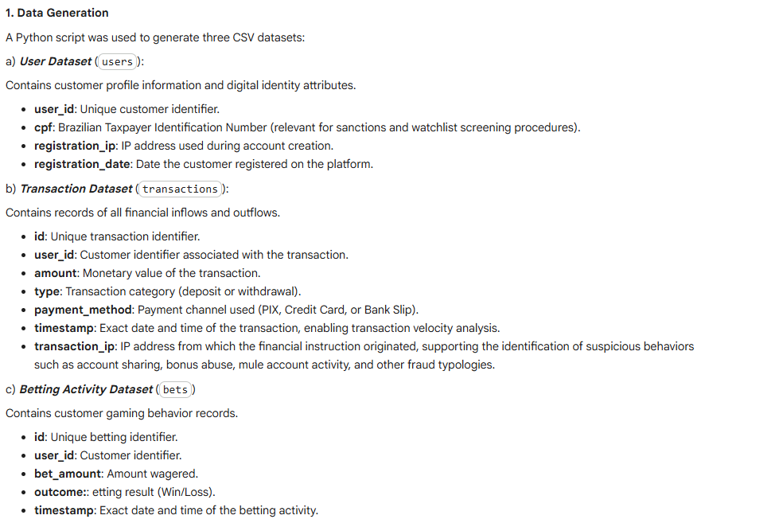
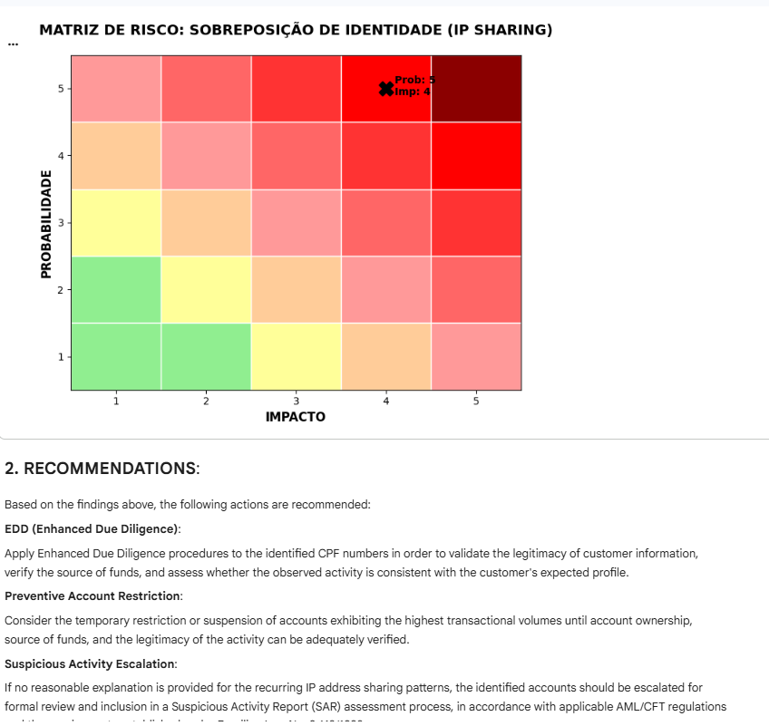

# AML Transaction Monitoring Investigation - iGaming Sector

## Overview

This project simulates an AML (Anti-Money Laundering) investigation within the iGaming sector using a synthetic dataset containing over 100,000 financial transactions.

The objective is to identify suspicious customer behavior patterns associated with money laundering, fraud, and regulatory non-compliance through SQL analysis, risk assessment methodologies, and Enhanced Due Diligence (EDD) recommendations.

---

## Objectives

* Detect suspicious customer activity using transaction monitoring techniques.
* Identify potential money laundering typologies.
* Apply a risk-based approach to customer investigations.
* Produce investigative findings and compliance recommendations.

---

## Technologies Used

* Python
* SQL (SQLite)
* Pandas
* NumPy
* Matplotlib
* Jupyter Notebook

---

## Investigated Typologies

### 1. Identity Overlap (IP Sharing)

Detection of multiple customer accounts operating from the same IP address.

Potential risks:

* Identity fraud
* Multi-accounting
* Bonus abuse
* Mule account networks
* Concealment of beneficial ownership

### 2. Structuring (Smurfing)

Identification of customers conducting numerous low-value deposits which collectively exceed significant monetary thresholds.

Potential risks:

* Placement-stage money laundering
* Transaction monitoring evasion
* Source of funds concealment

---

## Regulatory Framework

The investigation was conducted considering:

* FATF Recommendations
* Brazilian AML Law (Law No. 9,613/1998)
* SPA/MF Regulatory Framework for iGaming
* Risk-Based Approach principles

---

## Key Deliverables

* SQL-based transaction analysis
* Risk matrix assessments
* Investigation notes
* Enhanced Due Diligence recommendations
* Final AML Investigation Report

---

## Screenshots

### Dataset Generation

### Identity Overlap Investigation

### Structuring Investigation

### Risk Matrix

---

## Disclaimer

This project was developed exclusively for educational and portfolio purposes. All data is synthetic and does not represent real customers, transactions, or financial institutions.
